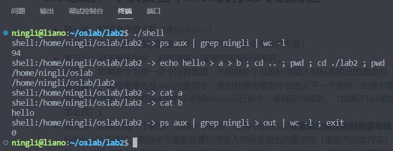
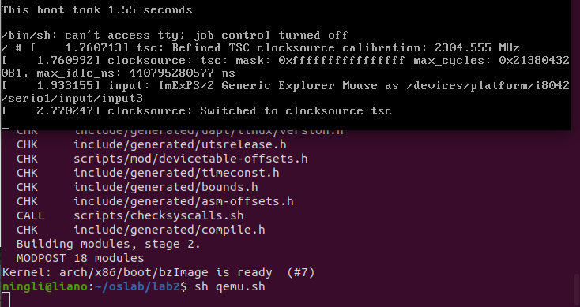

# lab2 report

## 实验目的

- 学习如何使用Linux系统调用：实现一个简单的 shell
- 学习如何添加Linux系统调用：实现一个简单的 top

## 实验环境

- OS: Ubuntu 20.04.4 LTS
- Linux内核版本: 4.9.263

## 实验内容

### shell

> 设置优先级为：分隔符(;) < 管道符(|) < 重定向符(>>)

#### 内置指令

由于子进程无法修改父进程的参数，所以改变当前 shell 的参数（如 source 命令、 exit 命令、 kill 命令）基本都是由shell内建命令实现的。

在本实验中我们实现三个简单的内置指令 `cd`, `kill`，`exit`。我们设计 `exec_buildin()` 函数来处理内置指令，核心代码如下：

```c
char old_path[MAX_BUF_SIZE]; // 保存上一次的工作目录
int exec_builtin(int argc, char**argv, int *fd) {
    if(argc == 0)
        return 0;
    if (strcmp(argv[0], "cd") == 0) {
        // "cd -" 切换到上一次的工作目录
        if (strcmp(argv[1], "-") == 0) {
            char tmp[MAX_BUF_SIZE];
            getcwd(tmp, MAX_BUF_SIZE);
            chdir(old_path);
            strcpy(old_path, tmp);
            return 0;
        }
        else {
            getcwd(old_path, MAX_BUF_SIZE);
            // chdir，改变当前工作目录
            return chdir(argv[1]);
        }
    }
    else if (strcmp(argv[0], "kill") == 0) {
        // kill，向进程发送信号
        if (argc == 2)
            return kill(atoi(argv[1]), SIGTERM);
        else if (argc == 3)
            return kill(atoi(argv[1]), atoi(argv[2]));
        else
            return -1;
    }
    else if (strcmp(argv[0], "exit") == 0){
        // exit，退出程序
        exit(0);
    }
    else {
        // 不是内置指令时
        return -1;
    }
}
```

1. cd 指令使用系统调用 `chdir()` 实现，直接将目标路径（可以是相对路径或绝对路径）作为参数传入即可。但不支持 `cd -` 的命令，所以需要开一个数组保存上一个工作目录（需要用到系统调用 `getcwd()` ），接收到 `cd -` 指令时返回上一个工作目录。
2. kill 指令使用系统调用 `kill()` 实现，将进程编号和信号量传入即可。
3. exit 指令使用系统调用 `exit()` 实现。

#### 重定向符

当指令中出现 `>`，`>>`，`<` 这三个重定向符时，需要将指令的标准输入或标准输出重定向为文件输入或输出。

我们设计 `process_redirect()` 函数处理重定向符，设置指令的输入输出，核心代码如下：

```c
int process_redirect(int argc, char** argv, int *fd) {
    /* 默认输入输出到命令行，即输入STDIN_FILENO，输出STDOUT_FILENO */
    fd[READ_END] = STDIN_FILENO;
    fd[WRITE_END] = STDOUT_FILENO;
    int i = 0, j = 0;
    while(i < argc) {
        int tfd;
        if(strcmp(argv[i], ">") == 0) {
            //打开输出文件从头写入
            tfd = open(argv[i+1], O_WRONLY | O_CREAT | O_TRUNC, 0666);
            if(tfd < 0) {
                printf("open '%s' error: %s\n", argv[i+1], strerror(errno));
            } 
            else {
                //输出重定向
                fd[WRITE_END] = tfd;
            }
            i += 2;
        }
        else if(strcmp(argv[i], ">>") == 0) {
            //打开输出文件追加写入
            tfd = open(argv[i+1], O_WRONLY | O_CREAT | O_APPEND, 0666);
            if(tfd < 0) {
                printf("open '%s' error: %s\n", argv[i+1], strerror(errno));
            } 
            else {
                //输出重定向
                fd[WRITE_END] = tfd;
            }
            i += 2;
        }
        else if(strcmp(argv[i], "<") == 0) {
            //读输入文件
            tfd = open(argv[i+1], O_RDONLY);
            if(tfd < 0) {
                printf("open '%s' error: %s\n", argv[i+1], strerror(errno));
            } 
            else {
                //输入重定向
                fd[READ_END] = tfd;
            }
            i += 2;
        }
        else {
            argv[j++] = argv[i++];
        }
    }
    argv[j] = NULL;
    return j;   // 新的argc
}
```

检测重定向符种类，判断重定向类型，重定向完成后返回去除了重定向符的实际命令。

重定向的实现：使用系统调用 `open()` 打开或创建文件，设置只写或只读，重头写入或追加写入，然后进行重定向。

返回实际指令：没碰到重定向符时，直接复制过去，碰到重定向符后需要 `i+=2` 跳过两个参数，分别是重定向符和目标文件。

> 这样写是支持把重定向符写在命令开头的，跳过后可以继续往后执行。

#### 管道

在含有管道的命令中，管道分隔的各个指令是并行的，所以内置指令也在子进程中运行，因此我们设计 `execute()` 函数，用于执行内置指令或普通指令。核心代码如下：

```c
int execute(int argc, char** argv) {
    int fd[2];
    // 默认输入输出到命令行，即输入STDIN_FILENO，输出STDOUT_FILENO 
    fd[READ_END] = STDIN_FILENO;
    fd[WRITE_END] = STDOUT_FILENO;
    // 处理重定向符，如果不做本部分内容，请注释掉process_redirect的调用
    argc = process_redirect(argc, argv, fd);
    if(exec_builtin(argc, argv, fd) == 0) {
        exit(0);
    }
    // 将标准输入输出STDIN_FILENO和STDOUT_FILENO修改为fd对应的文件
    dup2(fd[READ_END], STDIN_FILENO);
    dup2(fd[WRITE_END], STDOUT_FILENO);
    // execvp，执行命令
    execvp(argv[0], argv);
    exit(1);
}
```

先处理重定向符，然后使用系统调用 `execvp()` 执行指令。

然后我们设计一个函数 `run_command()` 用来执行可能带有 `|`, `>>` 等重定向符的一个或多个指令（以分号分隔），核心代码如下：

```c
// 运行一个包含管道或重定向符的命令
int run_command(char *cmdline) {
    /* 由管道操作符'|'分割的命令行各个部分，每个部分是一条命令 */
    /* 拆解命令行 */
    char *commands[128];
    int cmd_count = split_string(cmdline, "|", commands);
    if(cmd_count == 0)
        return 0;
    else if(cmd_count == 1) {     // 没有管道的单一命令
        char *argv[MAX_CMD_ARG_NUM];
        int argc;
        int fd[2];
        // 处理参数，分出命令名和参数
        argc = split_string(commands[0], " ", argv);
        if(exec_builtin(argc, argv, fd) == 0)
            return 0;
        // 创建子进程，运行命令，等待命令运行结束
        int pid = fork();
        if(pid == 0)
            execute(argc, argv);
        else	wait(NULL);
    }
    else { // 多管道，包含一个
        int read_fd;    // 上一个管道的读端口（出口）
        for(int i = 0; i < cmd_count; i++) {
            int pipefd[2];
            /* 创建管道，n条命令只需要n-1个管道 */
            if(i != cmd_count - 1) {
                int ret = pipe(pipefd);
                if(ret < 0) {
                    printf("pipe error!\n");
                    continue;
                }
            }
            int pid = fork();
            if(pid == 0) {
                /* 除了最后一条命令外，都将标准输出重定向到当前管道入口 */
                if(i != cmd_count - 1) {
                    dup2(pipefd[WRITE_END], STDOUT_FILENO);
                    close(pipefd[WRITE_END]);
                }
                /* 除了第一条命令外，都将标准输入重定向到上一个管道出口 */
                if(i != 0) {
                    dup2(read_fd, STDIN_FILENO);
                    close(read_fd);
                }
                char *argv[MAX_CMD_ARG_NUM];
                int argc = split_string(commands[i], " ", argv);
                execute(argc, argv);
                exit(255);
            }
            /* 父进程除了第一条命令，都需要关闭当前命令用完的上一个管道读端口 
            * 父进程除了最后一条命令，都需要保存当前命令的管道读端口 
            * 记得关闭父进程没用的管道写端口 */
            if(i != 0) {
                close(read_fd);
            }
            if(i != cmd_count - 1) {
                read_fd = pipefd[READ_END];
                close(pipefd[WRITE_END]);
            }
        }
        // 等待所有子进程结束
        while (wait(NULL) > 0);
    }
}
```

先以 `|` 为分隔符拆解命令行，如果不存在管道符，那么直接作为普通命令执行：如果是内置指令，就在父进程执行，如果是其他指令，就 `fork()` 一个子进程执行前面封装好的 `execute()` 函数。

如果存在管道符，那么需要根据管道符的数量多开子进程，子进程间并行。使用系统调用 `dup2()` 来重定向输入输出，除了最后一条命令外，都将标准输出重定向到当前管道入口，除了第一条命令外，都将标准输入重定向到上一个管道出口。然后调用 `execute()` 执行。

最后等待所有子进程结束，命令运行结束。

#### 多命令

由 `;` 分隔的多个子命令，和在多行中依次运行这些子命令效果相同。

```c
// 多命令执行
cmd_count = split_string(cmdline, ";", commands);
for (int i = 0; i < cmd_count; i++) {
    run_command(commands[i]);
}
```

直接依次运行即可。

### top

#### 注册

内核的汇编代码会在 `syscalls_64.h` 中查找调用号。为便于添加系统调用，x86平台提供了一个专门用来注册系统调用的文件 `syscall_64.tbl` 。在编译时，脚本 `syscalltbl.sh` 会被运行，将上述 `syscall_64.tbl` 文件中登记过的系统调用都生成到前面的 `syscalls_64.h` 文件中。因此我们需要修改 `syscall_64.tbl` 。

打开 `linux-4.9.263/arch/x86/entry/syscalls/syscall_64.tbl`，加入我们要注册的系统调用名字和编号即可，代码如下：

```c
332	common	mytop			sys_mytop
```

#### 声明

打开 `linux-4.9.263/include/linux/syscalls.h` ，里面是对于系统调用函数原型的定义，在最后面加上我们创建的新的系统调用函数原型。

代码如下：

```c
asmlinkage long sys_mytop(int __user * num, pid_t __user * pid,  char __user * name, int __user * state, u64 __user * runtime);
```

> 如果传入了用户空间的地址，需要加入 `__user` 宏来说明。

我们要传入 5 个参数，都是用户空间的地址，存储函数的返回值。第一个是进程个数，第二个是 pid 数组，第三个是进程名的数组，第四个是进程状态的数组，第五个是总运行时间的数组。

> 进程名数组实际上是二维数组，我们用一维数组实现，固定第二维为进程名的最大长度 15 + 1 = 16，每存储一个进程名就 name += 16，偏移到下一个存储地址。

#### 实现

在 `linux-4.9.264/kernel/sys.c` 代码的最后添加你自己的函数定义，用 `SYSCALL_DEFINEx()` 宏实现。

代码如下：

```c
SYSCALL_DEFINE5(mytop, int __user *, num, pid_t __user *, pid,  char __user *, name, int __user *, state, u64 __user *, runtime)
{
	struct task_struct* task;
	int count = 0;
	pid_t pid_temp;
	char name_temp[16];
	int state_temp;
	u64 runtime_temp;
	printk("[Syscall] mytop\n");
	printk("[StulD] PB21111715\n");
	for_each_process(task){
		pid_temp = task->pid;
		strcpy(name_temp, task->comm);
		state_temp = task->state;
		runtime_temp = task->se.sum_exec_runtime;
		if (copy_to_user(pid++, &pid_temp, sizeof(pid_t)))
			return -1;
		if (copy_to_user(name, name_temp, sizeof(char)*16))
			return -1;
		if (copy_to_user(state++, &state_temp, sizeof(int)))
			return -1;
		if (copy_to_user(runtime++, &runtime_temp, sizeof(u64)))
			return -1;
		name += 16;
		count++;
	}
	if (copy_to_user(num, &count, sizeof(int)))
		return -1;
	return 0;
}
```

调用 `printk()` 函数输出系统调用名字和我的学号；调用 `for_each_process()` 函数遍历所有进程，将需要的信息 copy 到用户空间，然后返回。

#### 测试

用 C 语言编写测试代码，实现类似 `top` 指令的功能，定时调用上面写的系统调用 `mytop`，然后计算各进程 cpu 占用率，并按降序排列，打印出前 20 个进程。

代码如下：

```c
#define MAX 1000
int main(int argc, char *argv[]) {
	int num = 0;
	__pid_t pid[MAX];
	char name[MAX][16];
	int state[MAX];
	__U64_TYPE runtime[MAX];
	int num_old = 0;	// 上一次的进程数
	__pid_t pid_old[MAX];
	__U64_TYPE runtime_old[MAX];	// 保存旧进程的 pid 和 runtime
	double cpu_usage[MAX];
	int table[MAX]; // 按占用率排序后的映射表
	int interval;
	if (argc == 1)
		interval = 1;
	else
		interval = atoi(argv[1]);
	syscall(332, &num_old, pid_old, name, state, runtime_old);
	while(1) {
		system("clear");
		syscall(332, &num, pid, name, state, runtime);
		for (int i = 0; i < num; i++) {
			int j;
			for (j = 0; j < num_old; j++) {
				if (pid[i] == pid_old[j]) {	// 保证同一进程
					cpu_usage[i] = (runtime[i] - runtime_old[j]) / (10000000.0 * interval);
					break;
				}
			}
			if (j >= num_old)
				cpu_usage[i] = runtime[i] / (10000000.0 * interval); // 新进程
			table[i] = i;
		}
		num_old = num; // 更新老进程
		for (int i = 0; i < num; i++) {	
			pid_old[i] = pid[i];
			runtime_old[i] = runtime[i];
		}
		// 排序获得占用率前20，第一个元素是占用率最大的
		printf("PID\t \tNAME\t \tSTATE\t \tCPU_USAGE(%%)\tRUNTIME(ns) \n");
		for (int i = 0; i < 20; i++) {
			for (int j = i + 1; j < num; j++) {
				if (cpu_usage[table[i]] < cpu_usage[table[j]]) {
					int tmp = table[i];
					table[i] = table[j];
					table[j] = tmp;
				}
			}
			printf("%-8d \t%-16s %-8d \t%-8lf \t%-8lu \n", pid[table[i]], name[table[i]], !state[table[i]], cpu_usage[table[i]], runtime[table[i]]);
		}
		sleep(interval);
	}
	return 0;
}
```

通过编号调用 `mytop()` 获得所有进程的相关信息，然后分别计算各进程的 cpu 占用率(实际运行时间 / 刷新间隔)，再通过~~交换排序~~(选择排序)获得占用率前 20，最后打印输出。

> 定义映射表 table[]，不用实际交换进程信息所在位置，交换下标即可，可以减少时间开销。

> 注意：计算时要保证是同一个进程，因为下标会变

## 实验结果

### 测试 shell

#### 编译


#### 运行


#### 测试

**单命令、单管道、重定向符**


**多命令、多管道**



**kill**

默认参数


强制结束


### 测试 mytop

#### 编译

为了方便测试，我写了一个编译代码和 linux 内核的脚本，代码如下：

```bash
#!/bin/bash
gcc -static -o mytop get_ps_info.c
sudo cp mytop ~/oslab/busybox-1.32.1/_install
cd ~/oslab/busybox-1.32.1/_install
find . -print0 | cpio --null -ov --format=newc | gzip -9 > ~/oslab/initramfs-busybox-x64.cpio.gz
cd ~/oslab/linux-4.9.263
make -j $((`nproc`-1))
```

运行结果如下：


#### 运行

还有一个启动 qemu 的脚本，代码如下：

```bash
#!/bin/bash
qemu-system-x86_64 -kernel ~/oslab/linux-4.9.263/arch/x86_64/boot/bzImage -initrd ~/oslab/initramfs-busybox-x64.cpio.gz --append "nokaslr root=/dev/ram init=/init"
```

运行结果如下：



#### 测试


## 实验总结

#### 收获

- 学会了系统调用的使用和 shell 的原理
- 学会了系统调用的注册和实现

#### 建议

难度适中，无建议