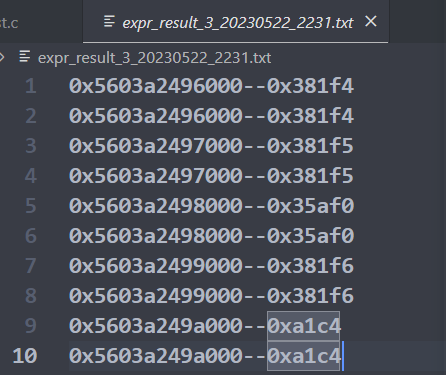

# lab3 report

## Part1

### 实验目标

- 使用显式空闲链表实现一个64位堆内存分配器

  - 内存分配器的初始化和堆扩容
  - 实现两种基本搜索空闲块的算法 

  - 实现空闲块的合并和分配
  - 实现实时的分配器内存使用情况统计

- 学会以动态链接库的形式制作库并使用 

- 体会系统实验数据的测量和分析过程

### 实验环境

- 虚拟机：

  - APP: VMware Workstation Pro 

  - OS：Ubuntu 20.04.4 LTS
  - 内存：8GB
  - 处理器：4

- 物理机：

  - CPU: i7-11800H @2.30GHz
  - 内存：32G

### 实验过程

#### 原理介绍

##### 分配器

分配器结构如下：


以下就简称 堆 1 和 堆 2。

> 堆 1 类似零售店，从系统申请内存，再给需要的用户；堆 2 是用户，向堆 1 要内存；当堆 1 不够用时，堆 1 再向系统补货。

##### 内存块

内存块结构如下，分为已分配块和空闲块两种：


一个空闲块由 头部、前驱、后继、内容、脚部 组成，其中头部和脚部存储 块大小(63:3)、前块的分配情况(1)、此块的分配情况(0)；前驱部分指向显式空闲链表的前一个空闲块的地址（也是该块的前驱部分），后继部分指向显式空闲链表的后一个空闲块的地址；因此最小空闲块大小 `MIN_BLK_SIZE` 为 4 个字的大小。

为了代码简洁，代码中定义了一系列针对块操作的简单宏，这里就不详细介绍了，后面用到再说明。

#### 分配器初始化

> 对应于源码的函数 `mem_init()`

主要代码如下：

```c
mem_start_brk = (char *)sbrk(MAX_HEAP);
mem_brk = mem_start_brk;
mem_max_addr = mem_start_brk + MAX_HEAP;
```

先通过系统调用 `sbrk()` 给分配器初始化一个 `MAX_HEAP` 大小的内存（5MB），即堆 1 初始增长 5MB，所以 mem_max_addr 增长 5MB；堆 2 初始大小为 0，所以 mem_brk 初始等于 mem_start_brk

#### 堆扩容

> 对应于源码的函数 `mem_sbrk()`

主要代码如下：

```c
if (mem_brk + incr <= mem_max_addr)
    mem_brk += incr;
else {
    sbrk(MAX_HEAP);
    mem_max_addr += MAX_HEAP;
    mem_brk += incr;
}
```

分两种情况，当 mem_brk + incr <= mem_max_addr，即堆 1 还够用时，直接把内存分给堆 2 即可；当堆 1 不够用时，需要用系统调用 `sbrk()` 扩容堆 1，再把内存分配给堆 2

#### 空闲块搜索

> 对应于源码的 `find_fit_first()` 和 `find_fit_best()` 函数 

##### first_fit

主要代码如下：

```c
for (char *bp = free_listp; bp; bp = (char *)GET_SUCC(bp)){
    if (asize <= GET_SIZE(HDRP(bp)))
        return bp;
}
return NULL;
```

遍历空闲链表，找到第一个大小符合要求的，直接 return，没有则返回 NULL

> GET_SUCC(bp) 为获得块 bp 的后继块的宏操作
> HDRP(bp) 为获得块 bp 的头部的宏操作，与 GET_SIZE 一块使用可以获得块大小

##### best_fit

主要代码如下：

```c
void *best_bp = NULL;
size_t best_size = -1; // 0xffffffff
for (char *bp = free_listp; bp; bp = (char *)GET_SUCC(bp)){
    if (asize <= GET_SIZE(HDRP(bp)) && GET_SIZE(HDRP(bp)) < best_size){
        best_bp = bp;
        best_size = GET_SIZE(HDRP(bp));
    }
}
return best_bp;
```

在遍历过程中记录当前最适合的块的地址和大小，在遍历过程中不断更新，需要遍历整个空闲链表后再返回。

#### 分配空闲块

> 对应于源码的 `place()` 函数

主要代码如下：

```c
size_t remain_size = GET_SIZE(HDRP(bp)) - asize;
if (remain_size < MIN_BLK_SIZE){
    PUT(HDRP(bp), PACK(GET_SIZE(HDRP(bp)), 1, 1));
    PUT(FTRP(bp), PACK(GET_SIZE(HDRP(bp)), 1, 1));
    delete_from_free_list(bp);
    char *head_next_bp = HDRP(NEXT_BLKP(bp));
    PUT(head_next_bp, PACK_PREV_ALLOC(GET(head_next_bp), 1));
}
else{
    PUT(HDRP(bp), PACK(asize, 1, 1));
    PUT(FTRP(bp), PACK(asize, 1, 1));
    delete_from_free_list(bp);
    PUT(HDRP(NEXT_BLKP(bp)), PACK(remain_size, 1, 0));
    PUT(FTRP(NEXT_BLKP(bp)), PACK(remain_size, 1, 0));
    add_to_free_list(NEXT_BLKP(bp));
}
user_malloc_size += GET_SIZE(HDRP(bp));
```

> 1. NEXT_BLKP(bp) 用于获取 bp 块的后面邻居块的地址
> 2. 这里 asize 已经是对齐后的大小，不一定是用户真正需要的大小

先计算去掉用户需要的大小，该空闲块还剩多少，分两种情况：若剩余大小小于最小空闲块大小，则直接把整个块分给用户，即把整个块都设置为已分配块，并从空闲链表中移除；否则只分配用户需要的大小，剩下的块分割出来作为新的空闲块。

#### 合并空闲块

> 对应于源码的 `coalesce()` 函数

主要代码如下：

```c
if (prev_alloc && next_alloc){ /* 前后块均已分配 */
    add_to_free_list(bp);
}
else if (prev_alloc && !next_alloc){ /*前块已分配，后块空闲*/
    delete_from_free_list(NEXT_BLKP(bp));
    size_t next_size = GET_SIZE(HDRP(NEXT_BLKP(bp)));
    size += next_size;
    PUT(HDRP(bp), PACK(size, 1, 0));
    PUT(FTRP(bp), PACK(size, 1, 0));
    add_to_free_list(bp);
}
else if (!prev_alloc && next_alloc){ /*前块空闲，后块已分配*/
    size_t prev_size = GET_SIZE(HDRP(PREV_BLKP(bp)));
    size += prev_size;
    PUT(HDRP(PREV_BLKP(bp)), PACK(size, 1, 0));
    PUT(FTRP(PREV_BLKP(bp)), PACK(size, 1, 0));
    bp = PREV_BLKP(bp);
}
else{ /*前后都是空闲块*/
    delete_from_free_list(NEXT_BLKP(bp));
    size_t prev_size = GET_SIZE(HDRP(PREV_BLKP(bp)));
    size_t next_size = GET_SIZE(HDRP(NEXT_BLKP(bp)));
    size += (prev_size + next_size);
    PUT(HDRP(PREV_BLKP(bp)), PACK(size, 1, 0));
    PUT(FTRP(PREV_BLKP(bp)), PACK(size, 1, 0));
    bp = PREV_BLKP(bp);
}
```

> PACK() 用于打包数据
> PUT() 用于写数据

当一个块被 `free` 时，需要调用该函数将该空闲块先尽量与周围的空闲块合并，再尝试加入空闲链表。

合并分为四种情况：

1. 前后块均已分配：无法合并，直接加入空闲链表
2. 后块空闲：三步走，
   - 将后块移出空闲链表
   - 该块吞并后块
   - 将该块加入空闲链表
3. 前块空闲：一步即可，
   - 前块吞并该块（需要更改 bp 指向，用于 return）
4. 前后块均空闲：一步即可，
   - 前块吞并该块和后块（需要更改 bp 指向）

#### 占用率统计

主要代码如下：

```c
size_t user_malloc_size = 0;
size_t heap_size = 0;
double get_utilization() {
    return (long double)user_malloc_size / heap_size;
}
void mm_free(void *bp) {
    size_t size = GET_SIZE(HDRP(bp));
    user_malloc_size -= size;
}
static void place(void *bp, size_t asize) {
    user_malloc_size += GET_SIZE(HDRP(bp));
}
int mm_init(void) {
    heap_size += 32;
}
static void *extend_heap(size_t words) {
    size_t size;
    size = (words % 2) ? (words + 1) * WSIZE : words * WSIZE;
    heap_size += size;
}
```

在 free 某个块时，用户内存减少，在 place（分配）某个块时，用户内存增加；

在分配器初始化时，分配器内存初始增加 32，后续在 extend_heap 时，分配器内存增加；

> 这里考虑用户内存增加时只考虑对齐后的需求量，即块大小，而不是实际需求量

### 实验结果

两种搜索算法运行结果分别如下图：

##### first_fit


##### best_fit


可以看出，`first_fit` 的内存占用率更低，但速度更快；`best_fit` 的内存占用率更高，但速度较慢。两者是一对典型的 `trade-off`

### 总结

从结果上来看，该部分主要实现了以下内容：

- 内存分配器的实现
- 两种搜索算法的比较

实验难度较大，其中此 part1 难度就不容小觑，调试过程中见了一万次 `segment fault`。凭借 printf 调试大法，一步步定位问题，解决问题，发现新的问题，解决新的问题。。。总共耗时将近一天完成（其实真正写代码debug的时间并不多，更多时间是在理解文档和代码框架的逻辑）。

刚开始做的时候感觉特别难，做完了后又觉得明白通透，没啥难度？特别是写这个报告的时候，感觉逻辑很清晰，可能这就是会者不难吧，总之收获挺大的。

至于选做部分，感觉挺复杂的，而且 1 分额外加分也没啥诱惑力（不像隔壁 cod，选做不做实验分得不满，这点我支持 OS），就偷懒了。。。

## Part2

### 实验目标

了解 linux 系统的内存管理方式

- 了解虚拟内存的管理方式
- 了解 VMA 是什么，以及 VMA 的遍历和统计
- 了解 linux 的多级页表机制，并自己实现一个虚拟地址到物理地址的转换函数
- 了解 linux 的页面置换算法，统计页面冷热并输出至图表观察
- 了解用户地址空间的分布，并将用户进程中的数据转储至外存

完成代码填空

### 实验环境

- 虚拟机：

  - APP: VMware Workstation Pro 

  - OS：Ubuntu 20.04.4 LTS
  - linux 内核版本：Linux 5.15.0-72-generic x86_64
  - 内存：8GB
  - 处理器：4

- 物理机：

  - CPU: i7-11800H @2.30GHz
  - 内存：32G

### 实验过程

#### 原理介绍

##### 内存分层

在 linux 系统中，用户的内存空间可以分为以下几个层次：

- 段（包括堆、栈、数据段、代码段等）
- VMA（一块连续的线性地址空间）
- 页（虚拟内存的基本管理单元）

一个段可能包含多个 VMA，一个 VMA 包含多个页

##### 内存描述符mm

在 linux 中，每个进程看到的都是只属于自己的虚拟地址空间。为此，Linux 在每个进程的进程控制块结构体 task_struct 中记录了该进程的虚拟内存相关信息，即内存描述符 `struct mm_struct *mm`，本实验中要用到的部分成员如下：

```c 
struct mm_struct {
	/* 该进程的虚拟内存区域VMA链表 */
	struct vm_area_struct *mmap;
	/* 代码段和数据段的起始地址和结束地址 */
	unsigned long start_code, end_code, start_data, end_data;
}
```

##### 虚拟内存区域VMA

一个 VMA 就是一块连续的线性地址空间的抽象，它拥有自身的权限（可读、可写、可执行等等），每一个虚拟内存区域都由一个相关的 `struct vm_area_struct *vma` 结构来描述，本实验要用到的部分成员如下：

```c
struct vm_area_struct {
	struct mm_struct * vm_mm; /* 所属的内存描述符 */
	unsigned long vm_start; /* vma的起始地址 */
	unsigned long vm_end; /* vma的结束地址 */
	/* 该vma的在一个进程的vma链表中的前驱vma和后驱vma指针，链表中的vma都是按地址来排序的*/
	struct vm_area_struct *vm_next, *vm_prev;
}
```

##### 页与页框

在Linux中，进程中的(逻辑)内存块被称为页(page)，物理内存中的内存块被称为页框(Frame)，一般大小均为 4KB，连续的虚拟页可能会对应多个离散的物理页框。

在内核中，每一个物理页框使用一个**页描述符**(struct page)进行对应，每一个页框的页框号(physical address >> PAGE_SHIFT)是页描述符在 mem_map 数组的下标。

在Linux内核中可以使用 `follow_page()` 函数通过虚拟地址获取 page，该函数已经通过实验提供的脚本导出，直接使用即可。还可以使用 `page_referenced()` 函数通过 page 获取 PG_referenced，表示页面最近是否被访问。

##### 多级页表

进程使用的虚拟地址需要转换成物理地址，并根据此物理地址访问内存数据。Linux采用多级页表管理进程的内存空间，本实验只用到其中四级，分别为 pgd、pud、pmd、pt，结构类似下图：


本实验任务之一就是实现虚拟地址到物理地址的转换。

#### 统计VMA个数

> 对应源码的 `scan_vma()` 函数

主要代码如下：

```c
struct mm_struct *mm = get_task_mm(my_task_info.task);
if (mm){
    struct vm_area_struct *vma;
    int count = 0;
    for (vma = mm->mmap; vma; vma = vma->vm_next){
        count++;
    }
    my_task_info.vma_cnt = count;
    mmput(mm);
}
```

首先从进程结构体中获取内存描述符 mm，再从 mm 中获取虚拟内存区域 vma，然后通过 vma 链表遍历该进程所有的 vma 并计数。

#### 统计页面冷热

> 对应于源码的 `print_mm_active_info()` 函数

主要代码如下：

```c
struct mm_struct *mm = get_task_mm(my_task_info.task);
if (mm){
    struct vm_area_struct *vma;
    for (vma = mm->mmap; vma; vma = vma->vm_next){
        unsigned long vaddr;
        for (vaddr = vma->vm_start; vaddr < vma->vm_end; vaddr += PAGE_SIZE){
            struct page *page = mfollow_page(vma, vaddr, FOLL_GET);
            if (!IS_ERR_OR_NULL(page)){
                unsigned long vm_flags;
                int pg_refer = mpage_referenced(page, 0, (struct mem_cgroup *)(page->memcg_data), &vm_flags);
                if (pg_refer){
                    record_one_data(page_to_pfn(page));
                }
            }
        }
    }
    flush_buf(1);
    mmput(mm);
}
```

首先从进程结构体中获取内存描述符 mm，再从 mm 中获取虚拟内存区域 vma，然后通过 vma 链表遍历该进程所有的 vma，对每一个 vma，遍历其包含的页，通过 `follow_page()` 函数获取页描述符 page(对应一个物理页框)，对每个页框调用 `page_referenced()` 函数获取 pg_refer，如果大于 0，则将对应物理地址写入文件。 

通过 `flush_buf(1)` 实现每统计一次换行一次。

> ```c
> typedef typeof(follow_page) *my_follow_page;
> static my_follow_page mfollow_page = (my_follow_page)0xffffffffb4cea8a0;
> ```
>
> 通过函数虚拟地址使用 linux 内核中未导出的函数 follow_page()

#### 遍历页表

> 对应源码的 `virt2phys()` 和 `traverse_page_table()` 函数

`virt2phys()` 函数的主要代码如下：

```c
pgd_t *pgd = pgd_offset(mm, virt);
pud_t *pud = pud_offset((p4d_t*)pgd, virt);
pmd_t *pmd = pmd_offset(pud, virt);
pte_t *pte = pte_offset_kernel(pmd, virt);
page = pte_page(*pte);
return page_to_pfn(page);
```

逐级查找即可。

`traverse_page_table()` 函数的主要代码如下：

```c
struct vm_area_struct *vma;
for (vma = mm->mmap; vma; vma = vma->vm_next){
    unsigned long vaddr;
    for (vaddr = vma->vm_start; vaddr < vma->vm_end; vaddr += PAGE_SIZE){
        struct page *page = mfollow_page(vma, vaddr, FOLL_GET); // 用于验证
        if (!IS_ERR_OR_NULL(page)){
            record_two_data(vaddr, page_to_pfn(page));
        }
        unsigned long pfn = virt2phys(mm, vaddr);
        if (pfn){
            record_two_data(vaddr, pfn);
        }
        flush_buf(0);
    }
}
flush_buf(1);
mmput(mm);
```

同样是遍历 vma。

#### 内核数据转储

> 对应于源码的 `print_seg_info()` 函数

主要代码如下：

```c
addr = mm->start_data;
struct vm_area_struct *vma;
do {
    vma = find_vma(mm, addr);
    if (!vma)	break;
    unsigned long vaddr;
    for (vaddr = vma->vm_start; vaddr < vma->vm_end ; vaddr += PAGE_SIZE){
        struct page *page = mfollow_page(vma, vaddr, FOLL_GET);
        if (!IS_ERR_OR_NULL(page)){
            char* virt_addr = kmap_atomic(page);
            memcpy(buf, virt_addr, PAGE_SIZE);
            curr_buf_length += PAGE_SIZE;
            flush_buf(1);
            kunmap_atomic(virt_addr);
        }
    }
    flush_buf(1);
    addr = vma->vm_end;
}
while (addr < mm->end_data);
```

先通过内存描述符 mm 获得数据段的起始地址，再使用 `find_vma()` 函数查找该地址后的第一个 vma，然后遍历 vma 中的页，使用 `kmap_atomic(page)` 得到可以直接访问的虚拟地址，然后使用`memcpy()` 函数将数据拷贝到全局变量 buf 中以写入到文件中。然后继续查找后面地址对应的 vma。

代码段同理。

### 实验结果

首先在虚拟机中打开本次实验的实验文档 pdf 文件，然后通过 `ps aux | grep pdf` 得到该进程的 pid 为 4014，如下图：


然后修改 `ktest.c` 代码中的 `pid` 为 4014，再依次修改 `ktest_func` 为 1,2,3,4,5，通过运行指令 `sudo ./run_expr.sh x` 进行逐一测试（x = 1,2,3,4,5）。结果如下：

#### func1


得到 vma 数量为 39，符合预期。

#### func2

页面冷热随时间的分布情况如下图：


结果与示例接近，输出在时间上具备一定的周期性。

#### func3

输出文件部分内容如下：



对于每个相同的地址，前一行是通过 `follow_page()` 和 `page_to_pfn()` 得到的地址，后一行是通过 `virt2phys()` 得到的地址，可以看出，结果相同。

#### func4

输出文件部分内容如下：


符合要求。func5 同理

### 总结

此部分主要针对 linux 的内存管理，实现了四个函数，功能分别是：

- 统计进程 vma 数量
- 统计进程页面冷热并绘图
- 遍历页表并输出物理页框号
- 将进程数据段或代码段的内容输出到文件

从代码量和 debug 难度上来看，part2 比 part1 要简单许多，但 part2 需要更多的操作系统知识，所以上手比较慢，大概也花了将近一天完成（主要在写这个报告，4000 多字，累死了，上一次写那么长的报告还是在程设进阶的大作业）。

lab3 终于结束了。。。
