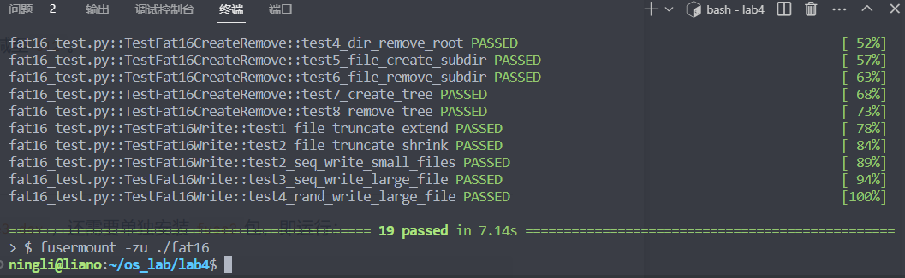
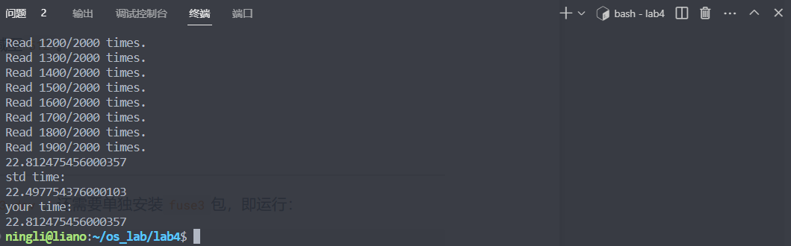

# lab4 report

## 实验目标

- 熟悉 FAT16 文件系统存储结构
  - FAT 表项
  - 簇，扇区
  - 目录项
- 利用 FUSE 实现一个 FAT 文件系统
  - 文件或目录的读
  - 文件或目录的创建与删除
  - 文件或目录的写
- 优化文件系统性能（**选做**）

## 实验环境

- 虚拟机：

  - APP: VMware Workstation Pro 

  - OS：Ubuntu 20.04.4 LTS
  - 内存：8GB
  - 处理器：4

- 物理机：

  - CPU: i7-11800H @2.30GHz
  - 内存：32G

## 实验过程

关于环境配置的问题实验文档已经讲的很清楚了，不再赘述。这里主要是解释代码填空。

### 任务一：读文件或目录

#### read_fat_entry

> 读取给定簇号的 FAT 表项

先计算在哪个扇区（FAT 表的起始扇区 + 偏移量），再计算在扇区中的偏移量。先读取整个扇区，再取目标部分。

代码如下：

```c
cluster_t read_fat_entry(cluster_t clus) {
    char sector_buffer[PHYSICAL_SECTOR_SIZE];
    // 计算表项扇区号
    size_t offset = clus * sizeof(cluster_t);
    sector_t sector = offset / meta.sector_size + meta.fat_sec;
    // 读取扇区
    sector_read(sector, sector_buffer);
    // 读取表项值
    offset %= meta.sector_size;
    return *(cluster_t *)(sector_buffer + offset);
}
```

#### find_entry_in_sectors

> 在给定的连续扇区中查找给定名称的目录项

循环遍历每个待查找扇区的每个目录项，比较文件名。若找到了目标文件，返回 `FIND_EXIST`，若找到了空槽，返回 `FIND_EMPTY`，否则返回 `FIND_FULL`（表示没找到且这些扇区都满了）

**注意**：排除已被删除的目录项的干扰。

代码如下：

```c
int find_entry_in_sectors(const char* name, size_t len, sector_t from_sector, size_t sectors_count, DirEntrySlot* slot) {
    char buffer[PHYSICAL_SECTOR_SIZE];
    // 对每一个待查找的扇区：
    for(size_t i = 0; i < sectors_count; i++) {
        // 读取第 i 个扇区
        sector_read(from_sector + i, buffer);
        for(size_t off = 0; off < meta.sector_size; off += DIR_ENTRY_SIZE) {
            DIR_ENTRY* dir = (DIR_ENTRY*)(buffer + off);
            // 检测目录项是否合法
            if (is_deleted(dir)) {
                continue;
            }
            // 比较文件名
            if(check_name(name, len, dir)) {
                // 找到目标文件
                slot->dir = *dir;
                slot->sector = from_sector + i;
                slot->offset = off;
                return FIND_EXIST;
            }
            else if (is_free(dir)) {
                // 找到空槽
                slot->dir = *dir;
                slot->sector = from_sector + i;
                slot->offset = off;
                return FIND_EMPTY;
            }
        }
    }
    // printf("find_entry_in_sectors: no empty slot\n");
    return FIND_FULL;
}
```

后面还有个函数 `find_entry_internal` 是基于此函数的，虽然函数本身很复杂，但要填的地方很简单，这里就不提及了。

#### fat16_readdir

> 读目录的主函数，读取给定路径的目录包含哪些文件

找路径对应目录的目录项，获取第一个簇的信息，然后遍历每一个簇的每一个扇区。

**注意**：碰到空项就可以停止了，提升性能；排除非法项的干扰，例如已删除的项

代码如下：

```c
int fat16_readdir(const char *path, void *buf, fuse_fill_dir_t filler, off_t offset, 
                    struct fuse_file_info *fi, enum fuse_readdir_flags flags) {
    bool root = path_is_root(path);
    // DIR_ENTRY dir;
    cluster_t clus = CLUSTER_END;
    if(!root) {
        DirEntrySlot slot;
        DIR_ENTRY* dir = &(slot.dir);
        int ret = find_entry(path, &slot);
        if(ret < 0) {
            return ret;
        }
        clus = dir->DIR_FstClusLO;    // 不是根目录
        if(!is_directory(dir->DIR_Attr)) {
            return -ENOTDIR;
        }
    }
    // 要读的目录项的第一个簇位于 clus，请你读取该簇中的所有目录项。
    char sector_buffer[MAX_LOGICAL_SECTOR_SIZE];
    char name[MAX_NAME_LEN];
    // 遍历簇
    while (root || is_cluster_inuse(clus)) {
        sector_t first_sec;
        size_t nsec;
        if(root) {
            first_sec = meta.root_sec;
            nsec = meta.root_sectors;
        } else {
            first_sec = cluster_first_sector(clus);
            nsec = meta.sec_per_clus;
        }
        // 遍历扇区
        for(size_t i = 0; i < nsec; i++) {
            sector_t sec = first_sec + i;
            sector_read(sec, sector_buffer);
            // 遍历目录项
            for (size_t off = 0; off < meta.sector_size; off += DIR_ENTRY_SIZE) {
                DIR_ENTRY* dir = (DIR_ENTRY*)(sector_buffer + off);
                if (is_free(dir))
                    break;
                if (!is_valid(dir))
                    continue;
                // 获取长文件名
                to_longname(dir->DIR_Name, name, sizeof(name));
                // 填入 buf
                filler(buf, name, NULL, 0, 0);
            }
        }
        if(root)	
            break;
        clus = read_fat_entry(clus);
    }
    return 0;
}
```

#### fat16_read

> 读文件的主函数，从path对应的文件的offset字节处开始读取size字节的数据

先找到要读的起始位置所在簇，然后计算在此簇中的偏移量，再调用 `read_from_cluster_at_offset` 函数即可。

代码如下：

```c
int fat16_read(const char *path, char *buffer, size_t size, off_t offset,
               struct fuse_file_info *fi) {
    printf("read(path='%s', offset=%ld, size=%lu)\n", path, offset, size);
    if(path_is_root(path)) {
        return -EISDIR;
    }
    DirEntrySlot slot;
    DIR_ENTRY* dir = &(slot.dir);
    int ret = find_entry(path, &slot);
    if(ret < 0) {
        return ret;
    }
    if(is_directory(dir->DIR_Attr)) {
        return -EISDIR;
    }
    if(offset > dir->DIR_FileSize) {
        return -EINVAL;
    }
    size = min(size, dir->DIR_FileSize - offset);
    cluster_t clus = dir->DIR_FstClusLO;
    size_t p = 0;
    while (offset >= meta.cluster_size) {
        offset -= meta.cluster_size;
        clus = read_fat_entry(clus);
    }
    while (p < size) {
        size_t len = min(meta.cluster_size - offset, size - p);
        read_from_cluster_at_offset(clus, offset, buffer + p, len);
        p += len;
        offset = 0;
        clus = read_fat_entry(clus);
    }
    return p;
}
```

> 后面写文件的代码和这里逻辑上是一样的，计算起始簇和偏移量。

### 任务二：创建、删除文件或目录

#### dir_entry_write

> 写入给定的目录项

先整个读取目录项所在的扇区，再将目录项写入到恰当位置，最后再写回扇区。

代码如下：

```c
int dir_entry_write(DirEntrySlot slot) {
    char sector_buffer[PHYSICAL_SECTOR_SIZE];
    sector_read(slot.sector, sector_buffer);
    memcpy(sector_buffer + slot.offset, &(slot.dir), sizeof(DIR_ENTRY));
    sector_write(slot.sector, sector_buffer);
    return 0;
}
```

这里提一下 slot 的数据结构：

- `DIR_ENTRY dir`
- `sector_t sector`
- `size_t offset`

存储了一个目录项的具体内容，以及它所在扇区，和它在该扇区中的偏移量。

**注意：** 后面创建目录项时也要用到这个，其中第二和第三个成员指代目标地址

#### write_fat_entry

> 修改 FAT 表项

和读 FAT 表项一样计算位置，读取整个扇区，修改目标位置，再写回。

代码如下：

```c
int write_fat_entry(cluster_t clus, cluster_t data) {
    char sector_buffer[MAX_LOGICAL_SECTOR_SIZE];
    size_t clus_off = clus * sizeof(cluster_t);
    size_t sec_off = clus_off % meta.sector_size;
    for(size_t i = 0; i < meta.fats; i++) {
        sector_t fat_sec = meta.fat_sec + i * meta.sec_per_fat;
        sector_t clus_sec = clus_off / meta.sector_size + fat_sec;
        sector_read(clus_sec, sector_buffer);
        memcpy(sector_buffer + sec_off, &data, sizeof(cluster_t));
        sector_write(clus_sec, sector_buffer);
    }
    return 0;
}
```

#### alloc_clusters

> 分配簇

扫描 FAT 表，找 n 个空闲的簇，将其链接起来并返回第一个簇，注意要清空找到的簇。

代码如下：

```c
int alloc_clusters(size_t n, cluster_t* first_clus) {
    if (n == 0)
        return CLUSTER_END;
    // 用于保存找到的n个空闲簇，另外在末尾加上CLUSTER_END，共n+1个簇号
    cluster_t *clusters = malloc((n + 1) * sizeof(cluster_t));
    size_t allocated = 0; // 已找到的空闲簇个数
    // 使用 read_fat_entry 函数来读取FAT表项的值，根据该值判断簇是否空闲。
    for (size_t i = 2; i < meta.clusters; i++) {
        if (!read_fat_entry(i)) {
            clusters[allocated++] = i;
            if (allocated == n) {
                break;
            }
        }
    }
    if(allocated != n) {  // 找不到n个簇，分配失败
        free(clusters);
        return -ENOSPC;
    }
    // 找到了n个空闲簇，将CLUSTER_END加至末尾。
    clusters[n] = CLUSTER_END;
    // 清零要分配的簇
    for(size_t i = 0; i < n; i++) {
        int ret = cluster_clear(clusters[i]);
        if(ret < 0) {
            free(clusters);
            return ret;
        }
    }
    // 将每个簇连接到下一个
    for(size_t i = 0; i < n; i++) {
        write_fat_entry(clusters[i], clusters[i + 1]);
    }
    *first_clus = clusters[0];
    free(clusters);
    return 0;
}
```

#### fat16_mkdir

> 创建文件夹的主函数，创建 path 对应的文件夹

在给定路径里找空槽，创建目录项。

**注意**：新目录不是空，而有两个目录项，分别是 `.` 和 `..` ，所以需要分配一个簇并且再创建两个目录项

代码如下：

```c
int fat16_mkdir(const char *path, mode_t mode) {
    printf("mkdir(path='%s', mode=%03o)\n", path, mode);
    DirEntrySlot slot;
    const char* filename = NULL;
    // 找空槽
    int ret = find_empty_slot(path, &slot, &filename);
    if(ret < 0) {
        return ret;
    }
    char shortname[11];
    ret = to_shortname(filename, MAX_NAME_LEN, shortname);
    if(ret < 0) {
        return ret;
    }
    // 分配簇
    ret = alloc_clusters(1, &(slot.dir.DIR_FstClusLO));
    if(ret < 0) {
        return ret;
    }
    // 创建目录项
    ret = dir_entry_create(slot, shortname, ATTR_DIRECTORY, slot.dir.DIR_FstClusLO, 2 * sizeof(DIR_ENTRY));
    if(ret < 0) {
        return ret;
    }
    
    const char DOT_NAME[] =    ".          ";
    const char DOTDOT_NAME[] = "..         ";
    // 创建.目录项
    slot.sector = cluster_first_sector(slot.dir.DIR_FstClusLO);
    slot.offset = 0;
    ret = dir_entry_create(slot, DOT_NAME, ATTR_DIRECTORY, slot.dir.DIR_FstClusLO, 2 * sizeof(DIR_ENTRY));
    if(ret < 0) {
        return ret;
    }
    // 创建..目录项
    slot.offset = sizeof(DIR_ENTRY);
    ret = dir_entry_create(slot, DOTDOT_NAME, ATTR_DIRECTORY, 0, 3 * sizeof(DIR_ENTRY));
    if(ret < 0) {
        return ret;
    }
    return 0;
}
```

#### fat16_rmdir

> 删除文件夹的主函数

先判断目录是否为空（忽略 `.` 和 `..`），再释放目录所占的所有簇，然后标记删除目录项。

**注意：** 排除已删除项的干扰

代码如下：

```c
int fat16_rmdir(const char *path) {
    printf("rmdir(path='%s')\n", path);
    if(path_is_root(path)) {
        return -EBUSY;
    }
    DirEntrySlot slot;
    int ret = find_entry(path, &slot);
    if(ret < 0) {
        return ret;
    }
    DIR_ENTRY* dir = &(slot.dir);
    if(!is_directory(dir->DIR_Attr)) {
        return -ENOTDIR;
    }
    // 读取目录项，判断目录是否为空(忽略.和..)
    cluster_t clus = dir->DIR_FstClusLO;
    char sector_buffer[MAX_LOGICAL_SECTOR_SIZE];
    while(is_cluster_inuse(clus)) {
        // 读取目录项
        sector_t first_sec = cluster_first_sector(clus);
        for(size_t i = 0; i < meta.sec_per_clus; i++) {
            sector_t sec = first_sec + i;
            sector_read(sec, sector_buffer);
            for(size_t off = 0; off < meta.sector_size; off += DIR_ENTRY_SIZE) {
                DIR_ENTRY* entry = (DIR_ENTRY*)(sector_buffer + off);
                // 忽略.和..
                if(is_dot(entry)) {
                    continue;
                }
                // 不为空
                if(!is_free(entry) && !is_deleted(entry)) {
                    return -ENOTEMPTY;
                }
            }
        }
        clus = read_fat_entry(clus);
    }
    // 释放目录所占的所有簇
    ret = free_clusters(dir->DIR_FstClusLO);
    if(ret < 0) {
        return ret;
    }
    // 删除目录项
    dir->DIR_Name[0] = NAME_DELETED;
    ret = dir_entry_write(slot);
    if(ret < 0) {
        return ret;
    }
    return 0;
}
```

### 任务三：写文件、裁剪文件

#### write_to_cluster_at_offset

> 在给定簇的给定位置写入给定大小的数据

先计算数据所在扇区，和扇区内偏移量，然后循环写入每一个扇区，直到写入完全。

代码如下：

```c
ssize_t write_to_cluster_at_offset(cluster_t clus, off_t offset, const char* data, size_t size) {
    assert(offset + size <= meta.cluster_size);  // offset + size 必须小于簇大小
    char sector_buffer[PHYSICAL_SECTOR_SIZE];
    size_t pos = 0;
    // 计算数据所在扇区
    sector_t first_sec = cluster_first_sector(clus);
    sector_t sec = first_sec + offset / meta.sector_size;
    // 计算数据在扇区中的偏移
    offset %= meta.sector_size;
    while (pos < size) {
        // 读取扇区
        sector_read(sec, sector_buffer);
        // 写入数据
        size_t write_size = min(size - pos, meta.sector_size - offset);
        memcpy(sector_buffer + offset, data + pos, write_size);
        // 写回扇区
        sector_write(sec, sector_buffer);
		// 更新状态
        pos += write_size;
        sec++;
        offset = 0;
    }
    return pos;
}
```

#### file_reserve_clusters

> 为文件分配新的簇以满足大小要求

先计算需要多少簇，然后分两种情况，如果文件原本没有簇，那么直接分配即可，否则需要分配恰当数量的簇，再与原来的拼接。

代码如下：

```c
int file_reserve_clusters(DIR_ENTRY* dir, size_t size) {
    // 计算需要多少簇
    size_t need_clus = size / meta.cluster_size + 1;
    // 文件没有簇
    if(!is_cluster_inuse(dir->DIR_FstClusLO)) {
        int ret = alloc_clusters(need_clus, &(dir->DIR_FstClusLO));
        if(ret < 0) {
            return -1;
        }
    }
    // 文件已有簇
    else {
        // 找最后一个簇
        cluster_t clus = dir->DIR_FstClusLO;
        need_clus--;
        while(is_cluster_inuse(read_fat_entry(clus))) {
            clus = read_fat_entry(clus);
            need_clus--;
        }
        if (need_clus <= 0) {
            return 0;
        }
        cluster_t temp;
        int ret = alloc_clusters(need_clus, &temp);
        if(ret < 0) {
            return -1;
        }
        // 连接簇
        write_fat_entry(clus, temp);
    }
    return 0;
}
```

#### fat16_write

> 写文件的主函数

四步走：

1. 找到目录项
2. 调整文件大小
3. 写入数据
4. 更新信息

各个步骤的实现方法前面都有过，这里就略过了。

代码如下：

```c
int fat16_write(const char *path, const char *data, size_t size, off_t offset,
                struct fuse_file_info *fi) {
    printf("write(path='%s', offset=%ld, size=%lu)\n", path, offset, size);
    // 找到文件目录项
    DirEntrySlot slot;
    int ret = find_entry(path, &slot);
    if(ret < 0) {
        return -1;
    }
    DIR_ENTRY* dir = &(slot.dir);
    // 扩展文件大小
    if(dir->DIR_FileSize < offset + size) {
        // printf("nobug there~");
        ret = file_reserve_clusters(dir, offset + size);
        if(ret < 0) {
            return -1;
        }
    }
    // 找到写入数据的起始簇
    cluster_t clus = dir->DIR_FstClusLO;
    int temp = offset / meta.cluster_size;
    while(temp--) {
        clus = read_fat_entry(clus);
    }
    off_t back_up = offset;
    offset %= meta.cluster_size;
    // 写入数据
    int pos = 0;
    while(pos < size) {
        size_t write_size = min(size - pos, meta.cluster_size - offset);
        // printf("nobug there~");
        ret = write_to_cluster_at_offset(clus, offset, data + pos, write_size);
        if(ret < 0) {
            return -1;
        }
        pos += write_size;
        offset = 0;
        clus = read_fat_entry(clus);
    }
    // 更改文件大小
    dir->DIR_FileSize = max(dir->DIR_FileSize, back_up + size);
    // 更新目录项
    dir_entry_write(slot);
    return pos;
}
```

#### fat16_truncate

> 裁剪文件大小

也是先找到目录项，然后得到文件原大小，再根据情况决定扩大或缩小。

代码如下：

```c
int fat16_truncate(const char *path, off_t size, struct fuse_file_info* fi) {
    printf("truncate(path='%s', size=%lu)\n", path, size);
    // 找到文件目录项
    DirEntrySlot slot;
    int ret = find_entry(path, &slot);
    if(ret < 0) {
        return -1;
    }
    DIR_ENTRY* dir = &(slot.dir);
    // 计算簇数
    int n1 = dir->DIR_FileSize / meta.cluster_size + 1;
    int n2 = size / meta.cluster_size + 1;
    // 文件大小不变
    if(n1 == n2) {}
    // 文件变小
    else if (n1 > n2) {
        // 找到最后一个簇
        cluster_t clus = dir->DIR_FstClusLO;
        cluster_t temp; // 记录最后一个簇
        while(n2--) {
            if (n2 == 0)
                temp = clus;
            clus = read_fat_entry(clus);
        }
        // 结束符提前
        write_fat_entry(temp, CLUSTER_END);
        // 释放簇
        free_clusters(clus);
    }
    // 文件变大
    else {
        // 扩展文件大小
        ret = file_reserve_clusters(dir, size);
        if(ret < 0) {
            return -1;
        }
    }
    // 更新文件大小
    dir->DIR_FileSize = size;
    // 更新目录项
    dir_entry_write(slot);
    return 0;
}
```

### 任务四：性能优化

由于期末压力，这个选做实在没时间写，摆摆了。

## 实验结果

**测试一**：读、写、创建、删除测试，运行结果如下：



可以看出，测试样例全部通过。


**测试二**：性能测试，运行结果如下：



性能大概是基准测试的 98%，符合要求。

## 总结

实验难度有点大，主要是不知道怎么调试，但磨了两天还是磨出来了，写完之后思路还是比较清晰的。

建议：别把实验放在期末周！😭
