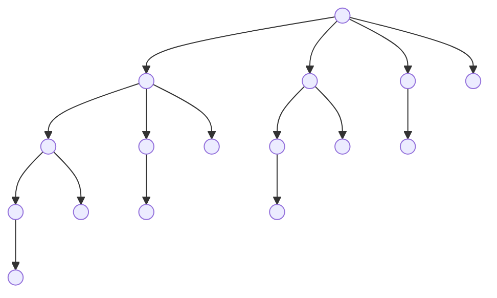

# 操作系统

## HW2

### T1

fork() 时会创建子进程从当前语句继续执行，所以执行情况如下图：

$$
1+4+6+4+1=16
$$
所以共有包含初始父进程在内的 16 个子进程

### T2

##### (1)

执行 `printf("LINE J")` 的条件是：

- 创建子进程成功，子进程中 pid = 0
- `execlp()` 调用失败，进程不会被新的程序替代

##### (2)

`wait()` 系统调用的作用是将父进程暂时挂起，等待所有子进程结束后再恢复执行

### T3

A：进入此分支的条件是 pid = 0，中间并没有改变 pid 的值，所以输出 0

B：获取子进程自己的 pid，输出 603

C：在父进程中，fork() 返回值为子进程的 pid，输出 603

D：父进程获取自己的 pid，输出 600

### T4

子进程是父进程的部分复制，所以子进程中对数据的改变不影响父进程，所以输出为

X：CHILD: 0  CHILD: -1 CHILD: -4 CHILD: -9 CHILD: -16

Y：PARENT: 0 PARENT: 1 PARENT: 2 PARENT: 3 PARENT: 4

### T5

如果 `execl()` 执行成功，那么 Y 就不会执行，否则可以执行。

因为 `execl()` 如果执行成功，进程的地址空间会被新程序 ls 占有，且 ls 执行结束后不会再继续执行(也无法再继续执行)原进程。

### T6

user-space:

程序代码，进程堆栈（包括临时数据，如函数参数、返回地址、局部变量）、数据段（包括全局变量）、堆等

kernel-space:

进程控制块 PCB（包括进程状态、程序计数器、CPU 寄存器、CPU 调度信息、内存管理信息、记账信息、I/O 状态信息）

### T7

- 给父进程提供反馈信息，父进程可以通过检查 PCB 获得子进程的状态信息来看子进程是否已终止
- 如果子进程正常结束，终止状态时可以提醒父进程，如果子进程出现错误终止，也能提醒父进程做出相应反馈
- 如果父进程中存在 `wait()` 系统调用，当子进程处于终止状态时，需要内核发出 SIGCHLD 信号结束父进程的等待

### T8

##### (1)

僵尸进程是指子进程调用 `exit()` 之后，清理了其在用户空间的所有数据和内核空间的大部分数据，只保留供其他进程访问的关于此进程的基本信息（pid、进程状态等），进程不再执行，但也没有彻底消失

##### (2)

进程终止时，内核向父进程发送 SIGCHLD 信号，父进程如果调用了 `wait()`，就会处理此信号，彻底清除发出信号的子进程；如果没调用 `wait()`，父进程会忽略 SIGCHLD 信号，如果父进程先终止，那么子进程会变为 `init` 进程的子进程，由 `init` 进程调用 `wait()` 清除

### T9

关键的区别是：`exec()` 会用指定的新程序代码替换现有的，并执行新进程且不会再返回原进程；

一般的函数调用只是暂时执行函数代码，函数执行结束后还会返回函数调用的地方继续执行。

### T10

##### (1)

多线程的好处：

- 多线程可以同时执行一个应用程序中的多个相似任务，比如 web 服务器，有时需要同时接收或回应许多客户端的请求，提升系统执行效率
- 多线程相比为每个任务创建一个进程更节省时间和空间开销，在一个应用程序中，很多数据可以被多个任务共享
- 多线程可以充分发挥多核 CPU 的性能，实现真正的并行而不是流水线

##### (2)

bc

堆内存和全局变量在多线程中共享，每个线程有自己的堆栈和寄存器

### T11

##### (a)

1 个父进程，1 个子进程，子进程又创建了 1 个子进程，三个进程在最后各创建一个进程，所以共创建了包含初始父进程在内的 6 个不同进程

##### (b)

`thread create(...)` 会在子进程中执行一次，子进程的子进程再执行一次，共两次，所以共创建了包含初始主线程在内的 3 个不同的线程

### T12

在子进程中创建新线程，调用 `runner()` 函数，使 value = 5，所以 LINE C 输出 `CHILD: value = 5`；

子进程结束后，父进程继续执行，value 没有被改变，所以 LINE P 输出 `PARENT: value = 0`

### T13

##### 共享对象(内存)

建立一块供协作进程共享的内存区域，进程可通过读写共享内存来交换信息

优点：不需要系统调用，不需要借助内核，速度快

缺点：需要避免冲突，对于分布式系统，共享内存更难实现

##### 消息传递

通过管道在协作进程间交换信息来实现通信

优点：无需避免冲突，更易实现

缺点：经常系统调用，时间开销大

### T14

- `ordinary pipe` 只能用于具有血缘关系的进程之间，`named pipe` 可以在互不相关的进程间实现通信；
- `ordinary pipe` 是一个单工（半双工）的通信模式，具有固定的读写端，`named pipe` 通过路径名来指出，在建立管道后可以当做普通文件来使用读写操作，但遵循先进先出的规则

