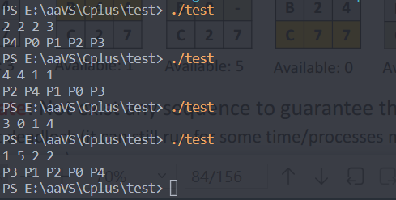
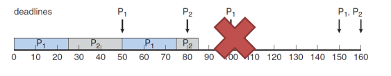
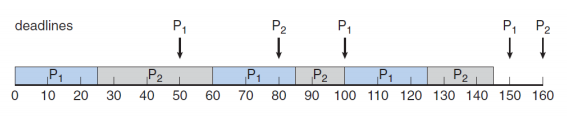

```mermaid
gantt
       dateFormat  S  
       axisFormat  %S
       todayMarker off
       title by Mermaid(ms)
       section FCFS
       
       P1 : des11, 0,10s
       P2 : des12, after des11, 1s
       P3 : des13, after des12, 2s
       P4 : des14, after des13, 1s
       P5 :	des15, after des14, 5s
       
       section  non SJF
       P2 : des21, 0,1s
       P4 : des22, after des21, 1s
       P3 : des23, after des22, 2s
       P5 : des24, after des23, 5s
       P1 :	des25, after des24, 10s
       
       section non Priority
       P2 : des46, 0,1s
       P5 : des47, after des46, 5s
       P1 : des48, after des47, 10s
       P3 : des49, after des48, 2s
       P4 :	des50, after des49, 1s
       
       section RR
       P1 : des31, 0,1s
       P2 : des32, after des31, 1s
       P3 : des33, after des32, 1s
       P4 : des34, after des33, 1s
       P5 :	des35, after des34, 1s
       P1 : des36, after des35, 1s
       P3 : des37, after des36, 1s
       P5 : des38, after des37, 1s
       P1 : des39, after des38, 1s
       P5 :	des40, after des39, 1s
       P1 : des41, after des40, 1s
       P5 :	des42, after des41, 1s
       P1 : des43, after des42, 1s
       P5 :	des44, after des43, 1s
       P1 : des45, after des44, 5s
```

# OS

## HW3

### T1

竞争条件：

两个或多个进程竞争访问不能被同时访问的资源，执行结果取决于进程访问共享资源的先后顺序。

解决方案：

保证互斥。具体有：禁用中断，严格轮转，互斥锁，Peterson's solution，信号量等

### T2

1. 互斥，不允许多个进程同时在临界区
2. 不存在有关进程间相对速度，系统内有多个 CPU 的假定
3. 任何在其关键部分之外运行的进程都不应阻止其他进程
4. 进程在有时间的等待后进入临界区

除去第二个外，分别为互斥、前进、有限等待三个要求

### T3

Peterson's solution：

代码如下：

```c
void enter_region( int process ) {
	int other; 
	other = 1-process;
	interested[process] = TRUE;
	turn = other;
	while ( turn == other && interested[other] == TRUE )
		; /* busy waiting */
}
void leave_region( int process ) {
	interested[process] = FALSE;
}
```

若进程 0 和 1 同时想要进入临界区，则 interested[0] == TRUE, interested[1] == TRUE，但 turn 不可能同时等于 0 和 1，所以两进程不可能同时进入临界区，满足互斥性；又 turn 肯定等于 0 或 1，所以两进程必定有一个能进入临界区，不会互相等待无限循环，满足前进性；若进程 0 在等待，进程 1 退出临界区时，interested[1] == FALSE，进程 0 的 while 循环立即结束，进入临界区，不会出现一个进程频繁反复进入临界区的情况，满足有限等待。

严格轮转方案：

不满足要求，一个进程不能连续两次进入临界区，在临界区外的进程可能阻塞其他进程。

### T4

死锁：每个进程都在等待只能通过其他进程释放的资源。

四个要求：

- 互斥：一次只能有一个进程使用某个资源
- 请求和保持：进程每次申请它需要的资源，同时继续占有已有的资源
- 不可剥夺：资源只能由占有它的进程在使用完毕后自愿释放。
- 循环等待：存在一个进程等待队列 P1, P2, ..., Pn，其中 P1 等待 P2 占有的资源，P2 等待 P3 占有的资源，..., Pn 等待 P1 占有的资源，形成循环。

### T5

##### (a)

执行 T4，available = (0, 1, 1, 2)，执行结束，available = (3, 2, 2, 4)

执行 T0，available = (0, 1, 1, 0)，执行结束，available = (4, 4, 2, 6)

执行 T1，available = (2, 1, 1, 4)，...

代码如下：

```cpp
#include<iostream>
int main() {
    int available[4];
    for (int i = 0; i < 4; i++)
        std::cin >> available[i];
    int T[5][2][4] = {
        {{1, 2, 0, 2}, {4, 3, 1, 6}},
        {{0, 1, 1, 2}, {2, 4, 2, 4}},
        {{1, 2, 4, 0}, {3, 6, 5, 1}},
        {{1, 2, 0, 1}, {2, 6, 2, 3}},
        {{1, 0, 0, 1}, {3, 1, 1, 2}}
    };
    int flag[5] = {0};
    for (int i = 0; i < 5; i++) {
        for (int j = 0; j < 5; j++) {
            if (flag[j] == 0) {
                if (available[0] + T[j][0][0] >= T[j][1][0] && available[1] + T[j][0][1] >= T[j][1][1] && available[2] + T[j][0][2] >= T[j][1][2] && available[3] + T[j][0][3] >= T[j][1][3]) {
                    available[0] += T[j][0][0];
                    available[1] += T[j][0][1];
                    available[2] += T[j][0][2];
                    available[3] += T[j][0][3];
                    flag[j] = 1;
                    std::cout << "P" << j << " ";
                    break;
                }
            }
        }
    }
}
```

所以执行顺序为：$T_4T_0T_1T_2T_3$

##### (b)

$T_2T_4T_1T_0T_3$

##### (c)

不安全的状态，B 的资源不足，无法执行任何进程

##### (d)

$T_3T_1T_2T_0T_4$



### T6

信号量：

信号量 S 是一种数据类型（附加的共享对象，例如整数），除了初始化之外，只能通过两个标准原子操作访问：wait()/down() 和 signal()/up()，用于记录资源的当前情况，管理资源分配。

功能：

用于进程同步，通常将信号量初始化为资源实例的数量。因此，当进程希望使用资源时，执行 down() 来减少信号量。当进程释放资源时，执行 up() 来增加信号量。当信号量为 0 时，可以选择阻止想要使用资源的进程，或者设置一个等待队列。

### T7

代码如下：

```c
#define N 5
#define LEFT ((i+N-1) % N)
#define RIGHT ((i+1) % N)
int state[N]; // 三种状态，eating(在吃), thinking(不想吃), hungry(想吃没吃)
semaphore mutex = 1; // 保证状态访问的互斥
semaphore s[N]; // 保证拿筷子的互斥
// 主函数
void philosopher(int i) {
    take(i);
    put(i);
}
// 拿筷子
void take(int i) {
    down(&mutex);
    state[i] = HUNGRY;
    test(i);
    up(&mutex);
    down(&s[i]);
}
// 放下筷子
void put(int i) {
    down(&mutex);
    state[i] = THINKING;
    // 劝邻座吃
    test(LEFT);
    test(RIGHT);
    up(&mutex);
}
// 尝试吃
void test(int i) {
    if(state[i] == HUNGRY && state[LEFT] != EATING && state[RIGHT] != EATING) {
        state[i] = EATING;
        up(&s[i]);
    }
}
```

### T8

##### (a)



##### (b)

如下表：

**turnaround time**

| process | FCFS | SJT  | Priority | RR   |
| ------- | ---- | ---- | -------- | ---- |
| P1      | 10   | 19   | 16       | 19   |
| P2      | 11   | 1    | 1        | 2    |
| P3      | 13   | 4    | 18       | 7    |
| P4      | 14   | 2    | 19       | 4    |
| P5      | 19   | 9    | 6        | 14   |

##### (c)

**waiting time**

| process | FCFS | SJT  | Priority | RR   |
| ------- | ---- | ---- | -------- | ---- |
| P1      | 0    | 9    | 6        | 9    |
| P2      | 10   | 0    | 0        | 1    |
| P3      | 11   | 2    | 16       | 5    |
| P4      | 13   | 1    | 18       | 3    |
| P5      | 14   | 4    | 1        | 9    |

##### (d)

FCFS: $\frac{10+11+13+14}{5}=9.6$

SJT: $\frac{9+2+1+4}{5}=3.2$

Priority: $\frac{6+16+18+1}{5}=8.2$

RR: $\frac{9+1+5+3+9}{5}=5.4$

所以 SJT 算法平均等待时间最短，为 3.2ms

##### (e)

**FCFS:**

优点：公平，实现简单，对长作业有利

缺点：不利于短作业，当长作业先执行时短作业会被阻塞很长时间

**SJT:**

优点：有助于提高系统吞吐量

缺点：不利于长作业，如果等待队列里有很多短作业，会使长作业不断推后

**Priority:**

优点：对高优先级作业响应快，常用与批处理系统或实时系统

缺点：可能出现低优先级作业无穷等待的问题

**RR:**

优点：兼顾长短作业，适用于分时系统

缺点：平均等待时间较长，上下文切换费时

### T9

**RMS**

单调速率调度算法：每个进程都被分配了与其速率成比例的优先级，并使用具有抢占（固定优先级）的静态优先级策略来调度进程

**EDF**

最早截止时间优先：根据任务的开始截止时间来确定任务优先级，截止时间越早，优先级越高，再根据优先级调度进程

**例子：**

P1：p1 = 50, t1 = 25

P2：p2 = 80, t2 = 35

RMS:



EDF:

