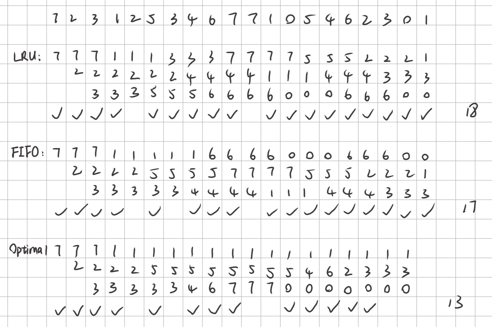

# OS

## HW4

### T1

`Segmentation fault`：段错误，一般是在非法访问内存时发生。比如：访问一个不存在的内存地址、访问没有访问权限的地址、栈溢出等

`TLB`：全称 Translation Lookaside Buffer，是一种特殊的高速缓存，存储最近使用的页表项，加速虚拟地址到物理地址的转换。

`Page fault`：缺页错误，CPU 要访问的页不在物理内存时触发，触发后操作系统为此页面分配实际物理地址。

`Demand paging`：请求调页，页面只有在程序执行期间被请求时才会被加载。

### T2

**1. ** 操作系统抖动，又叫颠簸。指高度的页面调度活动。如果一个进程的调页时间大于执行时间，那么这个进程就在抖动。

**2.** 若进程没有足够的帧数，发生缺页错误时，就会替换掉会再次使用的页面，这会导致再次快速产生缺页错误，发生抖动。

### T3

**a.** 100ns (先访问页表 50ns，再访问目标页 50ns)

**b.** $0.75\times (2+50)+0.25\times (2+50+50)=64.5ns$

### T4

设缺页错误比例为 p，则有：
$$
(1-p)\times 100ns + 0.3\times p\times 8ms + 0.7\times p\times 20ms\leq 200ns
$$
解得：
$$
p\leq 6.0976 \times 10^{-6}
$$
所以可接受的最大缺页错误概率为 $6.0976\times 10^{-6}$

### T5

页框占用如下表：

所以，LRU 算法 18 次缺页错误，FIFO 17 次，Optimal 13 次

### T6

**1.** 在置换算法中，给的物理页数增加，但虚页命中率反而会下降的现象叫做 Belady 异常

**2.** 在 LRU 算法中就不会出现此种异常，因为替换的是使用频率最低的页，留下的是使用频率高的页，当实页数增加时，能够留下的高频率访问的页就更多，命中率增加

### T7

服务顺序及移动距离如下表：

| Algorithm | Order                                                        | Distance |
| --------- | ------------------------------------------------------------ | -------- |
| FCFS      | 2150-2069-1212-2296-2800-544-1618-356-1523-4965-3681         | 13011    |
| SSTF      | 2150-2069-2296-2800-3681-4965-1618-1523-1212-544-356         | 7586     |
| SCAN      | 2150-2296-2800-3681-4965-(5999)-2069-1618-1523-1212-544-356  | 9492     |
| LOOK      | 2150-2296-2800-3681-4965-2069-1618-1523-1212-544-356         | 7424     |
| C-SCAN    | 2150-2296-2800-3681-4965-(5999)-(0)-356-544-1212-1523-1618-2069 | 11917    |
| C-LOOK    | 2150-2296-2800-3681-4965-356-544-1212-1523-1618-2069         | 9137     |

### T8

**a.** 访问顺序如下：

1. root directory
2. inode for /a
3. disk block for /a
4. inode for /a/b
5. disk block for /a/b
6. inode for /a/b/c
7. disk block for /a/b/c

共 7 次

**b.**

不用访问 inode，所以共 4 次

### T9

**硬链接** 是指多个文件名指向同一索引节点的链接

1. 硬链接，以文件副本的形式存在。但不占用实际空间。
2. 不允许给目录创建硬链接。
3. 硬链接只有在同一个文件系统中才能创建。
4. 删除其中一个硬链接文件并不影响其他有相同 inode 号的文件。

**软链接** 也叫符号链接，软链接就是一个普通文件，只是数据块内容有点特殊，存放的内容是另一文件的路径名的指向

1. 软链接是存放另一个文件的路径的形式存在。
2. 软链接可以跨文件系统 ，硬链接不可以。
3. 软链接可以对一个不存在的文件名进行链接，硬链接必须要有源文件。
4. 软链接可以对目录进行链接。

### T10

**Data Journaling**

先记录日志，再写数据，日志中包含用户数据

1. Journal write : 写日志
2. Journal commit : 在一条日志保存好之后，写入结束符
3. Checkpoint : 进行真正的写操作，把元数据(metadata)和用户数据(user data)写入文件系统

**Metadata Journaling**

先写用户数据，再写日志，日志中不包含用户数据

1. 写入用户数据(user data)
2. Journal write : 写日志
3. Journal commit : 在一条日志保存好之后，写入结束符
4. Checkpoint : 把元数据(metadata)写入文件系统